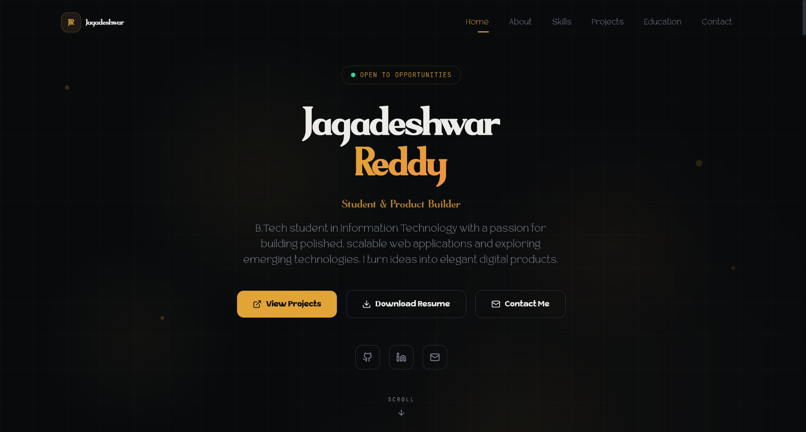
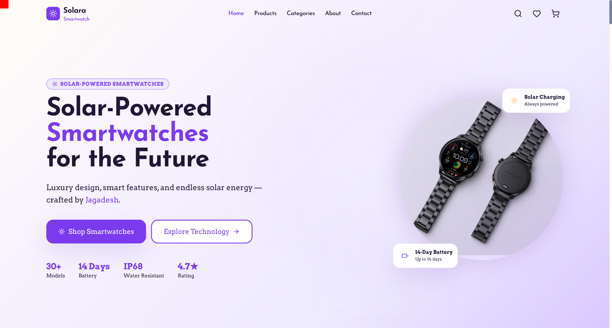
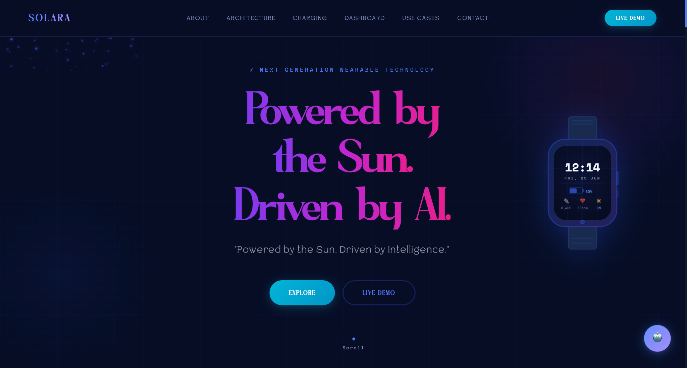

# Jagadeshwar Reddy
**B.Tech Information Technology Student**

*Passionate about Frontend Development, Artificial Intelligence, and Prompt Engineering.*

Currently building modern web applications with React, Vite, Supabase, and AI tools.

---

## 🛠️ Tech Stack

### Frontend Development

&nbsp;&nbsp;

&nbsp;&nbsp;

&nbsp;&nbsp;

&nbsp;&nbsp;

&nbsp;&nbsp;

 

### Backend & Database

 

### AI Tools & Prompt Engineering

&nbsp;&nbsp;

&nbsp;&nbsp;

 

### AI Builders

&nbsp;&nbsp;

 

### Design & Workflow

&nbsp;&nbsp;

&nbsp;&nbsp;

&nbsp;&nbsp;

---

## 🚀 Featured Projects

<table align="center" width="100%">
  <tr>
    <td width="33%" valign="top">
      <h3 align="center">Portfolio</h3>
      
       
      
A premium personal portfolio showcasing my projects, skills, and frontend development journey.

      
<strong>Tech Stack:</strong> React • Vite • UI/UX

      

        
        
      

    </td>
    <td width="33%" valign="top">
      <h3 align="center">HelioWatch</h3>
      
       
      
A solar-powered smartwatch e-commerce website with modern UI, product showcase, and responsive design.

      
<strong>Tech Stack:</strong> React • Vite • CSS

      

        
        
      

    </td>
    <td width="33%" valign="top">
      <h3 align="center">Solara</h3>
      
       
      
A modern futuristic website focused on solar-powered wearable technology and premium UI design.

      
<strong>Tech Stack:</strong> HTML • CSS • JavaScript

      

        
        
      

    </td>
  </tr>
</table>

---

## 📈 GitHub Analytics

---

## 🤝 Connect With Me

&nbsp;&nbsp;&nbsp;

&nbsp;&nbsp;&nbsp;

